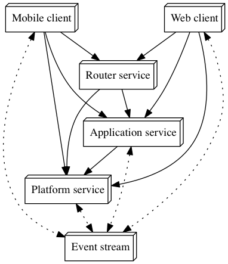

# About

Covers design, development and coding  guidelines as used in Nicheware Solutions Clojure projects.
# Categories

In describing the concepts used to architect and design an application or system of multiple applications and services, this document
uses categories.

A category consists of the category name, the objects that make up the category, and the transforms or relationships between those objects
in the category.

This is a simple framework for describing different levels of abstraction used in examining a system under development. In each category
the objects and relationships will often map to specific implementation constructs, such as microservice services, namespaces or functions.


# Namespaces
## Objective

In describing the design of a system implemented in a functional language like Clojure, the most obvious concept to deal with are functions.

However in a system of any complexity, the function to function level calling sequences can become too detailed and complex to get a good overview
of the system and the important relationships in the system. Higher level concepts are required.

Clojure provides two higher level concepts - namespaces, and build-time artifacts.

The artifacts are the technology components built and deployed as a single unit (eg jar files, js file) and will be discussed in the section [System Components](#system-components)

Namespaces are described in this section.

Because of the additional level of abstraction that namespaces can provide, we believe it is important to be able to have system design concepts reflected in the namespaces used within the Clojure code base.

Once namespaces reflect design concepts used within a project then it is easy for developers to grasp the design intentions of a codebase simply by viewing the namespaces used. It reduces (but does not remove) the need follow detailed function to function calling sequences.

What those design concepts are can vary between projects, as long as there are some consistent design principles being followed, and they are reflected in namespace names and relationships.

## Namespace mapping to design concepts

The design concepts and namespaces mappings to be used within Nicheware projects is described in the following section [System Design Concept](#system-design-concepts)

## Namespace category

In the following section on namespace rules, examples are shown using **Namespace category** diagrams. This category is defined as:

**Category**

Clojure Namespaces

**Objects**

Clojure namespaces, named according to the full namespace path leading from the root to the namespace.

**Morphism / ->**

Indicates transfer of runtime control from one business component to another, via a function call or variable reference.
* Black indicates this transfer is valid, according to Namespace rules.
* Red indicates this transfer is prohibited according to Namespace rules.

**Example**


## Namespace rules

Although the design concepts used may vary across application and component types, it is important to have some basic namespace rules that relfect good architectural and code structuring practices. These should hold regardless of which design concepts are being used.

This section documents those rules.

The summary is:
* **Rule 1**: Namespace dependencies cannot be circular
* **Rule 2**: A namespace cannot have a dependency on any ancestor namespace
* **Rule 3**: A namespace can have a dependency on a sibling namespace
* **Rule 4**: The impl namespace is private to its parent namespace

### Rule 1: Namespace dependencies cannot be circular

**Definition**

Namespace-A has a dependency on Namespace-B  if Namespace-A contains any variable or function that references any variable or function in Namespace-B.

These dependencies are transitive, so if Namespace-B then has a dependency on Namespace-C, then Namespace-A is considered to have a dependency on Namespace-C.

This rule prohibits circular dependencies between namespaces, either directly or via a chain of dependencies.

**Rationale**

This make sense not just from a Clojure code loading perspective, but also from architectural coupling point of view.

The less coupling between namespaces the easier it is to reason about the purpose and behaviour of any given namesapce. It also makes it easier to reuse the functions in a namespace across the application or to later refactor the application and extract namespaces into other services, libraries or components.

**Example**

The following is an example of a direct circular dependency, and is prohibited:

``` clojure
app.domain.widget/display -calls-> app.domain.bracket/display
app.domain.bracket/persist -calls-> app.domain.widget/persist  (PROHIBITED)
```


### Rule 2: A namespace cannot have a dependency on any ancestor namespace

**Definition**

An ancestor namespace of any given namespace is any namespace which appears in the namespace path down to the namespace.

For example: The namespace `app.domain.user.db` has the following ancestor namespaces

- app.domain.user
- app.domain
- app

This rule prevents a namespace from having a dependency (chained or direct) on any of its ancestor namespaces.

**Rationale**

Given this rule  defines a dependency relationship based on the namespace hierarchy, it makes it easy to reason about any expected calling dependencies between namespaces within a hierarchy without the need to exam any of the functions in the namespaces.

The rule as defined has an implication that namespaces in a hierarchy have a composition relationship - i.e. a parent namespace is composed of its child namespaces. i.e. Any function within a parent namespace may call any function within a child namespace. A child cannot call its parent (or ancestor) so results in a more standalone component grouping of functions (and namespaces)

An implication of this rule is that you could not define `protocols` in the parent then have implementations of them in child namespaces. This is a convention in some projects.

The alternative is to instead have the protocols in a sibling of the parent, and reference them from all other siblings. So the protocols and namespaces using those protocols are still grouped under the same parent, but there is no child -> ancestor calling dependency.

**Examples**

The following is prohibited:

``` clojure
pattern.domain.db/init -> pattern.domain/init (PROHIBITED)
```


### Rule 3: A namespace can have a dependency on a sibling namespace

**Definition**

Two namespaces are siblings if they share one or more ancestor namespaces.

This rules allows a namespace to have a dependency on any sibling namespace, eg a function can call functions in any siblings.

**Rationale**

This allows co-operation between the namespaces within a namespace parent component. Rule 1 and Rule 2 however restrict the coupling which that can exist, and clarify calling sequence possibilities.

**Examples**

The following are allowed:

``` clojure
  accounts.user.routes -> accounts.user.manager
  accounts.user.manager -> accounts.user.db.postgres
```


### Rule 4: The impl namespace is private to its parent namespace

**Definition**

With regard to the Nicheware coding conventions, **impl** is a reserved namespace word.

The parent namespace is the direct parent of the **impl** namespace.

This rule only allows the parent namespace or parent descendant namespaces to have a dependency on the **impl** namespace or any it is descendant namespaces.

This rule is a restriction on the sibling rule. The sibling rule allows any namespace to have a dependency anywhere down the sibling tree. The impl namespace marks a boundary point beyond which only direct descendants of the parent may access.

**Rationale**

The **impl** namespace brings the concept of public/private to the level of namespace dependencies. The intention is to allow a namespace (the direct parent) to have implementation namespaces (and their contained functions and variables) that are not accessible outside the parent namespace component.

This brings the benefits of information hiding. It allows for ease of maintenance within the impl namespaces, where changes and refactoring can be made knowing that the only users of those namespaces and functions are within the same parent component (as represented by the parent namespace)

**Examples**

``` clojure
  pattern.domain.curve/render -> pattern.domain.curve.impl.grid/new-size
  pattern.domain.curve.grid/render -> pattern.domain.curve.impl.grid/build-points
    pattern.client.view.mouse/on-click -> pattern.domain.impl/resize (PROHIBITED)
  pattern.client.view.mouse/on-click -> pattern.domain.impl.curve.grid/init (PROHIBITED)
```


### Rule 5: Descendants of impl can only have dependencies which would be valid if impl was removed
**Definition**

A descendant of **impl** is any namespace which has the **impl** as an ancestor.

Removing the **impl** namespace from a descendant means creating a namespace for the decsendant which has all ancestors except **impl**.

This rule states that a descendant may only have dependencies which would also be valid according to all other namespace rules for the same namespace with **impl** removed.

In addition it cannot call a namespace which would have the same name as the **impl** removed namespace.

**Rationale**

This is intended to support the concept that a ancestor namespace of the impl parent would be expected to call implementation functions in the similarly named descendant of the **impl** or private namespace.

From the other direction the **impl** namespace, would not be expected to have a dependency on the similarly named public namespace.

**Examples**

``` clojure
pattern.domain.curve.impl.grid/build-points -> pattern.domain.curve.util/dimensions
pattern.domain.curve.impl.grid/build-points -> pattern.domain.curve.grid/dimensions (PROHIBITED)
pattern.domain.curve.impl.grid.rows/display-points -> pattern.domain.curve.grid/dimensions (PROHIBITED)
```


# System Design Concepts
## System Component Types
This category describes the distributed architecture of any system/application that follows these Nicheware guidelines.

It defines types of microservices, functions or UI clients and the allowed runtime transfer invocations.

**Category**

> System Component Types

**Objects**

>   Runtime component types for the application. Components to which runtime control can be transferred. Application components are distributed, running in different processes and/or machines.

**Morphism / ->**

  Indicates transfer of runtime control from source to dest, via a HTTP request or RESTful API call (full arrows) or events (dotted arrow).

**Diagram**



**Object Descriptions**

 - **Mobile Client**: Mobile device application. Provides mobile specific user interface to the application or system.
 - **Web Client**: Browser accessible web application. Provides a browser specific user interface to the application or system.
 - **Router Service**: Services which transforms bundled client requests to appropriate calls to available application or platform services.

**Rules**

  - No cycles allowed for RESTful transforms (except the identity transfer)
  - The current plan is to only access the router services from clients. However this may be relaxed,
    and is not a forced restriction, so client could directly interact with application or platform services.

**Clojure Implementation**

 - Any application can be implemented in any technology stack, as all communication is language independent (RESTful JSON, JSON events)
 - However the current Nicheware guidelines are that
   * *_Microservices_*: will be implemented in Clojure using the _luminus_ configuration for RESTful implementation (_compojure-api_, _swagger_, _hugsql_)
   * *_WebClients_*: will be implemented in Clojurescript using the _om.next_ _react_ based framework. All clients will be mobile responsive.
   * *_Mobile Clients_*: will be implemented in Clojurescript running under _React Native_ using the _om.next_ framework.
 - Each Application component will be created as its own clojure project and git repository. (eg each microservice is a standalone project).
 - For application components specific to an application (clients or application services) the  code will be under a namespace  of the form _<company name>.<application-name>.[clients|services|common].<application-component-name>_
 - For platform client or service components (not specific to any one application) the code will be under a namespace of the form: _<company name>.[clients|services|common].<application component name>_
 - For example, assuming an application called _patterns_ with mobile designer clients and a web based marketplace:
