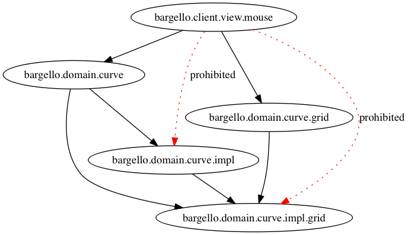

# Introduction
## About

This document describes the design, development and coding guidelines as used in Nicheware Solutions Clojure projects.

It includes the following main sections:

* [Coding style](#coding-style)
* [Namespaces](#namespaces)
* [System Design Concepts](#system-design-concepts)

## Categories

In describing the concepts used to architect and design an application or system of multiple applications and services, this document
uses **categories**.

A **category** consists of the category **name**, the **objects** that make up the category, and the **transforms** or relationships between those objects
in the category.

This is a simple framework for describing different levels of abstraction used in examining a system under development. In each category
the objects and relationships will often map to specific implementation constructs, such as microservice services, namespaces or functions.

# Coding style

The Nicheware code follows the style guidelines outlined in [Clojure Style Guide](https://github.com/bbatsov/clojure-style-guide), with the following exceptions:

- No need to avoid namespaces with more than 5 segments. (see Namespace section below for rationale)
- Use of ```defn-``` optional for private functions, to simplify unit test access.
- Docstring arguments are described using markdown list format.


# Namespaces

This section describes namespace conventions within Nicheware Clojure projects.

It covers:

* [Objective](#objective)
* [Namespace dependency category](#namespace-dependency-category)
* [Namespace rules](#namespace-rules)

## Objective

In describing the design of a system implemented in a functional language like Clojure, the most obvious concept to deal with are functions.

However in a system of any complexity, the function to function level calling sequences can become too detailed and complex to get a good overview
of the system and the important relationships in the system. Higher level concepts are required.

Clojure provides two higher level concepts - namespaces, and build-time artifacts.

The artifacts are the technology components built and deployed as a single unit (eg jar files, js file) and will be discussed in the section [System Components](#system-component-types)

Namespaces are described in this section.

Because of the additional level of abstraction that namespaces can provide, we believe it is important to be able to have system design concepts reflected in the namespaces used within the Clojure code base.

Once namespaces reflect design concepts used within a project then it is easy for developers to grasp the design intentions of a codebase simply by viewing the namespaces used. It reduces (but does not remove) the need to follow detailed function to function calling sequences.

Exactly which design concepts are used can vary between projects. What is more important is that there are some consistent design principles being followed, and they are reflected in namespace names and relationships.

The design concepts and namespaces mappings to be used within Nicheware projects are described in the following section [System Design Concepts](#system-design-concepts)

## Namespace Dependency category

In the following sections on namespace rules, examples are shown using **Namespace dependency** diagrams. This category is defined as:

**Category**

> Namespace Dependencies

**Objects**

> Clojure namespaces, named according to the full namespace path leading from the root to the namespace.

**Morphism / ->**

> Indicates transfer of runtime control from one namespace to another, via a function call or variable reference.
> * Black solid line indicates this transfer is valid, according to Namespace rules.
> * Red dotted line indicates this transfer is prohibited according to Namespace rules.

**Example**


## Namespace rules

Although the design concepts used may vary across application and component types, it is important to have some basic namespace rules that relfect good architectural and code structuring practices. These should hold regardless of which design concepts are being used.

This section documents those rules.

The summary is:
* **Rule 1**: Namespace dependencies cannot be circular
* **Rule 2**: A namespace cannot have a dependency on any ancestor namespace
* **Rule 3**: A namespace can have a dependency on a sibling namespace
* **Rule 4**: The ***impl*** namespace is private to its parent namespace
* **Rule 5**: Descendants of impl can only have dependencies which would be valid if impl was removed

### Rule 1: Namespace dependencies cannot be circular

**Definition**

*Namespace-A* is defined to have a dependency on *Namespace-B* if *Namespace-A* contains any variable or function that references any variable or function in *Namespace-B*.

These dependencies are transitive, so if *Namespace-B* then has a dependency on *Namespace-C*, then *Namespace-A* is considered to have a dependency on *Namespace-C*.

This rule prohibits circular dependencies between namespaces, either directly or via a chain of dependencies.

**Rationale**

This make sense not just from a Clojure code loading perspective, but also from architectural coupling point of view.

The less coupling between namespaces the easier it is to reason about the purpose and behaviour of any given namespace.

It also makes it easier to reuse the functions in a namespace across the application or to later refactor the application and extract namespaces into other services, libraries or components.

**Example**

The following is an example of a direct circular dependency, and is prohibited:

``` clojure
app.domain.widget/display -calls-> app.domain.bracket/display
app.domain.bracket/persist -calls-> app.domain.widget/persist  (PROHIBITED)
```


### Rule 2: A namespace cannot have a dependency on any ancestor namespace

**Definition**

An ancestor namespace of any given namespace is any namespace which appears in the namespace path down to the namespace.

For example: The namespace `app.domain.user.db` has the following ancestor namespaces

- app.domain.user
- app.domain
- app

This rule prevents a namespace from having a dependency (chained or direct) on any of its ancestor namespaces.

**Rationale**

Given this rule  defines a dependency relationship based on the namespace hierarchy, it makes it easy to reason about any expected calling dependencies between namespaces within a hierarchy without the need to examine any of the functions in the namespaces.

The rule as defined has an implication that namespaces in a hierarchy have a composition relationship - i.e. a parent namespace is composed of its child namespaces. i.e. Any function within a parent namespace may call any function within a child namespace. A child cannot call its parent (or ancestor) so results in a more standalone component grouping of functions (and namespaces)

An implication of this rule is that you could not define `protocols` in the parent then have implementations of them in child namespaces. This is a convention in some projects.

The alternative is to instead have the protocols in a child of the parent, and reference them from all other children. So the protocols and namespaces using those protocols are still grouped under the same parent, but there is no child -> ancestor calling dependency.

**Examples**

The following is prohibited:

``` clojure
bargello.domain.db/init -> bargello.domain/init (PROHIBITED)
```


### Rule 3: A namespace can have a dependency on a sibling namespace

**Definition**

Two namespaces are siblings if they share one or more ancestor namespaces.

This rules allows a namespace to have a dependency on any sibling namespace, eg a function can call functions in any siblings.

**Rationale**

This allows co-operation between the namespaces within a namespace parent component. Rule 1 and Rule 2 however control the couplings which can exist, and clarify calling sequence possibilities.

**Examples**

The following are allowed:

``` clojure
  accounts.user.controller -> accounts.user.manager
  accounts.user.manager -> accounts.user.db.postgres
```


### Rule 4: The impl namespace is private to its parent namespace

**Definition**

With regard to the Nicheware coding conventions, ***impl*** is a reserved namespace word.

The parent namespace is the direct parent of the ***impl*** namespace.

This rule only allows the parent namespace or parent descendant namespaces to have a dependency on the ***impl*** namespace or any it is descendant namespaces.

This rule is a restriction on the sibling rule. The sibling rule allows any namespace to have a dependency anywhere down the sibling tree. The ***impl*** namespace marks a boundary point beyond which only direct descendants of the parent may access.

**Rationale**

The ***impl*** namespace brings the concept of public/private to the level of namespace dependencies. The intention is to allow a namespace (the direct parent) to have implementation namespaces (and their contained functions and variables) that are not accessible outside the parent namespace component.

This brings the benefits of information hiding. It allows for ease of maintenance within the ***impl*** namespaces, where changes and refactoring can be made knowing that the only users of those namespaces and functions are within the same parent component (as represented by the parent namespace)

The use of ***impl*** is optional, and is only intended for complex namespaces where the number of functions or number of child namespaces under the unifying parent has grown large. In these cases it allows for a cleaner and more obvious seperation of public interface code from detailed implementation code.

For simpler namespaces, interface and implementation functions may co-exist in the same namespace. The Nicheware standard is to use layout conventions (function ordering, public/private comment markers) to make the difference clear between public and private functions. For ease of testing, private functions do not have to use the Clojure private modifier.

**Examples**

``` clojure
bargello.domain.curve/render -> bargello.domain.curve.impl.grid/new-size
bargello.domain.curve.grid/render -> bargello.domain.curve.impl.grid/build-points
bargello.client.view.mouse/on-click -> bargello.domain.impl/resize (PROHIBITED)
bargello.client.view.mouse/on-click -> bargello.domain.impl.curve.grid/init (PROHIBITED)
```


### Rule 5: Descendants of impl can only have dependencies which would be valid if impl was removed
**Definition**

A descendant of ***impl*** is any namespace which has the ***impl*** as an ancestor.

Removing the ***impl*** namespace from a descendant means creating a namespace for the decsendant which has all ancestors except ***impl***.

This rule states that a descendant of ***impl*** may only have dependencies which would also be valid according to all other namespace rules for the same namespace with ***impl*** removed from that descendant namespace.

In addition the descendant namespace cannot call a namespace which would have the same name as the ***impl*** removed namespace.

**Rationale**

This is intended to support the concept that a public descendant namespace of the ***impl*** parent would be expected to call implementation functions in the similarly named descendant of the ***impl*** or private namespace.

From the other direction the ***impl*** namespace, would not be expected to have a dependency on the similarly named public namespace.

**Examples**

``` clojure
bargello.domain.curve.impl.grid/build-points -> bargello.domain.curve.util/dimensions
bargello.domain.curve.impl.grid/build-points -> bargello.domain.curve.grid/dimensions (PROHIBITED)
bargello.domain.curve.impl.grid.rows/display-points -> bargello.domain.curve.grid/dimensions (PROHIBITED)
```


# System Design Concepts

This section describes the abstraction levels and design concepts used within Nicheware project, and how they map to Clojure implementation constructs.

It covers the following abstraction levels:

* [System Component Types](#system-component-types)
* [Business Component Types](#business-component-types)
* [Standard namespaces](#standard-namespaces)

## System Component Types

This category describes the distributed architecture of any system/application that follows these Nicheware guidelines.

It defines types of microservices, functions or UI clients and the allowed runtime transfer invocations.

**Category**

> System Component Types

**Objects**

> Runtime component types for the application. Components to which runtime control can be transferred. Application components are distributed, running in different processes and/or machines.

**Morphism / ->**

> Indicates transfer of runtime control from source to dest, via a HTTP request or RESTful API call (full arrows) or events (dotted arrow).

**Category Diagram**


**Object Descriptions**

 - **Mobile Client**: Mobile device application. Provides mobile specific user interface to the application or system.
 - **Web Client**: Browser accessible web application. Provides a browser specific user interface to the application or system.
 - **Router Service**: Service(s) which transforms bundled client requests to appropriate calls to available application or platform services.
 - **Application Service**: Services specific to the application domain. May utilise platform services.
 - **Platform Service**: Services that may be common across a number of applications (eg user authentication, media management). Include both Nicheware and generic cloud services
 - **Event Stream**: Event publishing and notification and persistence infrastructure. Services similar to Kafka and Kinesis.

**Rules**

  - No cycles allowed for HTTP and RESTful transforms (except the identity transfer)


**Clojure Implementation**

 - Any application can be implemented in any technology stack, as all communication is language independent (HTTP, RESTful JSON, JSON events)
 - However the current Nicheware guidelines are that:

   * ***Mobile Clients***: will be implemented in ClojureScript running under _React Native_ using the _om.next_ framework. Only used where features of the progressive web application not sufficient.

   * ***WebClients***: will be implemented in ClojureScript using the _om.next_ _react_ based framework. All clients will be mobile responsive, utilizing features of progressive web applications.

   * ***Router Service***: either a custom application web-frontend service, implemented with the same stack as an Application service, or a GraphQL service (custom or third party such as AWS AppSync)

   * ***Platform and Application services***: will be implemented as either
     - Docker container microservice instances running in a container cluster. Implemented in Clojure using the _luminus_ configuration for RESTful implementation (_compojure-api_, _swagger_, _hugsql_)

     - Virtual function based services, where a collection of functions deployed to a serverless environment like AWS Lambda make up the conceptual microservice. Implemented in Clojure and deployed as either a Javascript bundle to a AWS Node JS Lamda instance or a Java jar to an AWS Java Lamdba instance.


 - Each Application component will be created as its own Clojure project and git repository. (eg each microservice is a standalone project).

**Namespace mapping**

The System components are reflected in Clojure namespaces in the following ways

 - All namespaces start with the company name - `nicheware`
 - The second level namespace will either be the application name (eg `patterns`) or `platform`.
 - Any code which is to be shared across different system components (eg code used in both a web client and an application service) shall be under a 3rd level business component namespace such as *processes*, *entities* or *utilities*.
 - Any web clients will be under a 3rd level namespace `webapps`, followed by the name of the web client application.
 - Any mobile clients will be under a 3rd level namespace `mobileapps`, followed by the name of the mobile client application.
 - Any services (application or platform) will be under a 3rd level namespace `services`, followed by the name of the service.
 - All the system component namespaces prefixes are optional, depending on the size of the system and collection of applications.

   For example a development which was not open sourced, was a single web application and used no additional custom services could start with the application name and skip the _company.application.webapps_ prefix (eg no `nicheware.patterns.webapps` prefix)

**Example usage**

``` clojure
nicheware.platform.services.user-service
nicheware.patterns.components.bargello
nicheware.patterns.services.pattern-service
nicheware.patterns.webapps.pattern-designer
nicheware.patterns.mobileapps.pattern-store
```
System component instance diagram (RESTful calls):


Namespace diagram (function calls):


## Business Component Types

This category describes the types of Business components that can exist within any of the above described System Component types and the rules governing the communication allowed between these business components.

Communication is typically via function calls.

Any System Component built following the Nicheware guidelines and utilizing the design concept of Business Components will ensure all components conform to these rules.

A detailed description of the concept of Business Components can be found elsewhere in the Nicheware design guidelines.

**Category**

>  Business Component Types

**Objects**

>  Runtime Business component types used to compose a microservice. Components to which runtime control can be transferred. Components will all run within the same process.

**Morphism / ->**

>  Indicates transfer of runtime control from one business component to another, via a function call or variable reference.

**Category Diagram**


**Object descriptions**
 - **_Process_**: These components represent an application process or business activity. They often represent domain specific business tasks, and typically reflect the core activities of the business being modeled. They don't include any entities of their own but will manipulate others entities via the Entity components within the system.

 - **_Entity_**: These components represent the main business concepts within the application, and provide the necessary services to manage them, typically including all CRUD operations. They include management logic, but only that required to deal with the entities within the component. An entity component may manage multiple persistent entities if their lifecycle is tightly bound.

 - **_Utility_**: These components represent supporting concepts that are broadly reused across many different business components. Often they are invented concepts.

**Rules**
 - No cycles allowed
 - Entity components can call other Entity components (hence identity transform), but other restrictions apply such that no cycles within entity instance graphs are allowed.

**Clojure implementation**

 - A ***process*** component within a microservices could contain routers for API calls and manager functions. The manager could would contain the workflow logic for operate with one or more entity components. It typcially would not contain much if any domain code and no persistence code.

 - An ***entity*** component within a microservice system component could contain the controller for API calls to the entity, manager code for functions called directly from the routers to implement the API calls, domain code to implement the pure functional logic of the component, and code to handle the persistence of entity data.


**Namespace mappings**

 - There is typically not a Clojure file for the component namespace, just the directory containing the clojure files different typed namespaces making up that component.
 - A process component would be represented as a namespace with the process name under a `processes` namespace.
 - An entity component would be represented as a namespace with the entity name under a `entities` namespace.
 - A utility component would be represented as a namespace with the entity name under a `utilities` namespace.
 - For business components used by a single system component, the grouping namespaces of `processes`, `entities` and `utiltiies` can live under a services system component or a client system component. (eg: `nicheware.pattern.services.user-service.entities`)
- For business components shared acrosss system components, the grouping namespaces can live directly under the `platform` namespace or an application namespace. (eg `nicheware.platform.entities` or `nicheware.pattern.entities`)


**Example usage**

``` clojure
nicheware.platform.services.user-service.utilities.common (Utility Business Component)
nicheware.platform.services.user-service.entities.application (Entity Business Component)
nicheware.platform.services.user-service.entities.user (Entity Business Component)
nicheware.platform.services.user-service.processes.oauth (Process Business Component)
```


## Standard Namespaces

This category describes the standard namespaces that can exist within any of the above described business component or system component types and the rules governing the communication allowed between these namespaces.

The Namespace generic rules apply in all cases.

This category defines a set of standard namespace names and the dependency relationships between them as well as defining the purpose and scope of functions within those namespaces.

These standard namespaces are in addition to those outlined in the Namespace mapping for System components.

Communication is typically via function calls or variable references.

Any Business or System Component built following the Nicheware guidelines will conform to these rules.

**Category**

>  Standard namespaces

**Objects**

>  Namespaces used to implement Business components and/or System components.

**Morphism / ->**

>  Indicates transfer of runtime control from one namespace to another, via a function call or variable reference.

**Category Diagram**


**Object Descriptions**

 - **client**: Namespace for the main code within a client system component, such as a web app or mobile app.
 - **service**: Namespace for the main code within a service system component.
 - **view**: Namespace for view oriented functions or data definitions. eg React components.
 - **state**: Namespace for state information living in the client, and typically used to control the information displayed in the view.
 - **state.mutation**: Namespace for mutation functions that modify the client state.
 - **state.read**: Namespace for functions providing reads and queries of the client state.
 - **controller**: Namespace used to define API controller function, as entry points for services. eg route definitions for compojure.
 - **manager**: Namespace used for management or process functions. Can include the co-ordination of mutation operations, such as managing db functions in a service or managing calls to external services from a service or client.
 - **db**: Namespace for all persistence related functions, query or update.
 - **domain**: Namespace for pure functions specific to a given problem domain of the parent component, service or client. A large problem domain may include namespace hierarchy of descendants.
- **config**: Namespace for configuration data used in client or service. Includes functions and data defintions utilized by other namespace via whatever the standard configuration mechanism in use for the system component.

**Rules**

 - All generic namespace rules apply (eg no circular dependences, no calling of ancestor namespace from descedant etc)
 - A **client** can appear within a client system component, i.e. having a `webapps` or `mobileapps` ancestor.
   A `client` can also be the parent namespace in a utilities component, to distinguish between utility functions intended for client vs service use. It is not needed for namespaces which default to client usage (such as `view` and `state`)

 - A **service** can appear within a service system component, i.e. having a `services` ancestor.
   A `service` can also be the parent namespace in a utilities component, to distinguish between utility functions intended for client vs service use. It is not needed for namespaces which default to services usage (such as `manager` and `db`)

 - A **manager** namespace can appear within a service system component, within a client system component or within reusable component.

   If the **manager** is implementing the request logic for a service it will appear under the appropriate process or entity component in the service.

   If a service wants to expose its own API client code, it would use a `client.manager` namespace for the code, under the `services` namespace. eg `nicheware.platform.services.user-services.client.manager`

 - A **domain** namespace can appear within a process or entity component namespace under a service system component, within a client system component or within reusable component.

   If the **domain** contains functions used in the business logic for a service it will appear under the appropriate process, entity or utility component in the service.

   If a service wants to expose **domain** functions that are specific to a client API, it would use a `client.domain` namespace for the code, under the `services` namespace. eg `nicheware.platform.services.user-services.client.domain`

- A **view** namespace can appear within a client system component or within a reusable component.
 - A **state** and its child namespaces can appear within a client system component or within a reusable component.
 - A **controller** namespace can appear within a process or entity component namespace under a service system component or within reusable component.
 - A **db** namespace can appear within a process or entity component namespace under a service system component or within reusable component.
 - The use of these specially named sub-namespace is optional, depending on the size and complexity of the application or service.

   For example a very simple client application may have the view and state functions and variables all in the `client` namespace.

   Similarly a simple service with a single basic API call could have the controller, manager and db functions in the `service` namespace.

**Example usage**

Web client example:

``` clojure
nicheware.pattern.webapps.pattern-design.client
nicheware.pattern.webapps.pattern-design.view
nicheware.pattern.webapps.pattern-design.state
nicheware.pattern.entities.bargello.view
nicheware.pattern.entities.bargello.state.read
nicheware.pattern.entities.bargello.state.mutation
nicheware.pattern.entities.bargello.domain
nicheware.platform.aws.services.cognito.client.manager
nicheware.platform.aws.services.cognito.client.domain
```


Service example:

``` clojure
nicheware.platform.services.user-service.service
nicheware.platform.services.user-service.config
nicheware.platform.services.user-service.entities.user.controller
nicheware.platform.services.user-service.entities.user.manager
nicheware.platform.services.user-service.entities.user.db
nicheware.platform.services.user-service.entities.user.domain
nicheware.platform.services.user-service.processes.oauth.manager
```


## Contributors

The diagrams used in these guidelines are generated via graphviz, using a controlling makefile.

Required installation:

- make: On macOS - ```xcode-select --install```
- graphviz: On macOS - ```brew install graphviz```

To update any diagram:

- edit the appropriate ```.dot``` file in ```docs/graphviz```
- run make
- this will generate ```.png``` files for all modified ```.dot``` files in ```docs/generated```

```
cd $DEV_HOME/clj-guidelines
make
```

## License

Copyright © 2018 Nicheware Solutions Pty Ltd

Distributed under the Eclipse Public License either version 1.0 or (at your option) any later version, the same as Clojure.
